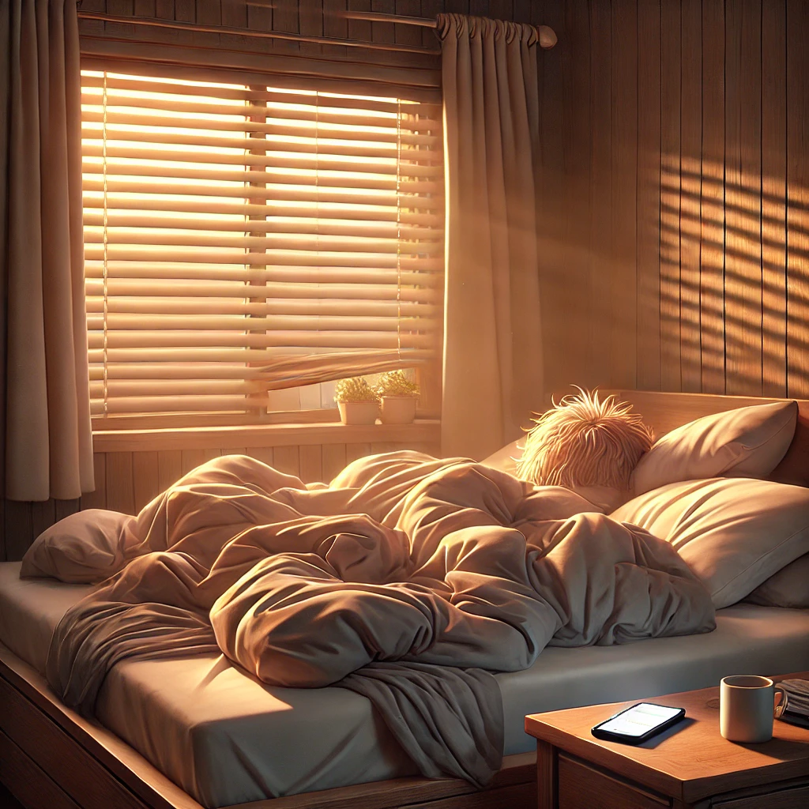
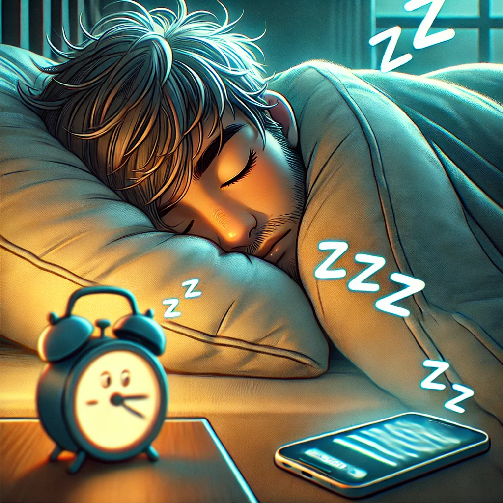
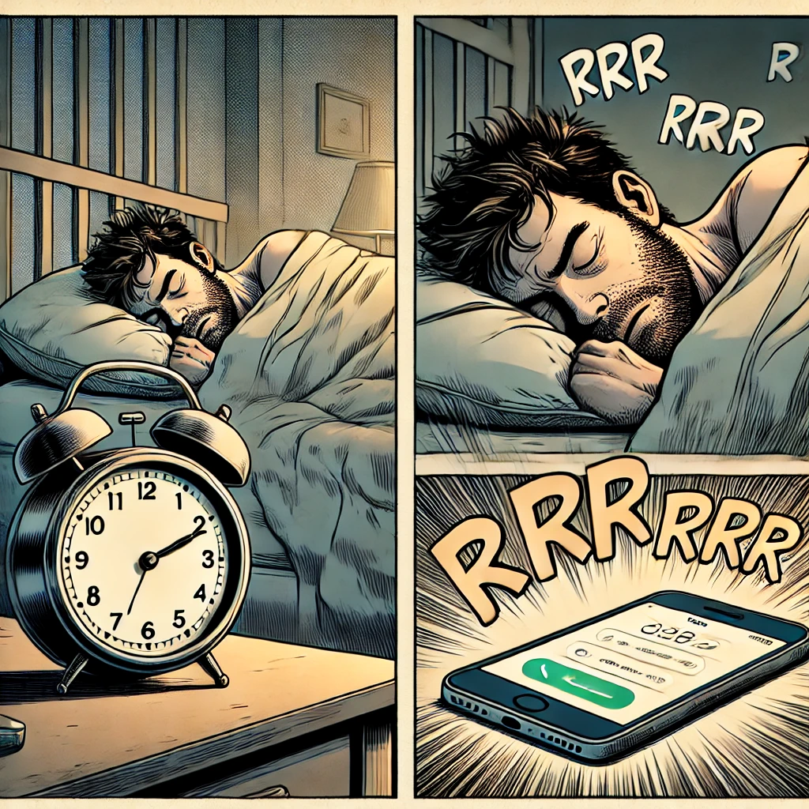

# Aufgabe

Erstelle eine Seite für meinen Comic über das Leben von Tom mit ChatGPT.

- Storyline: Die Geschichte in einem Satz. (Von Dir)
- Storyboard: Wie sieht die Geschichte aus? (Zusammen mit ChatGPT)
- Bildbeschreibung & Panels (Bilder): Was ist auf den einzelnen Bildern zu sehen? (Erstes Bild detailiert von ChatGPT beschrieben)
- Dialoge: Was sagen die Figuren? (Von Dir)
- Zusammenfügen: In einem Graphikprogram, füge die Bilder und Dialoge zusammen.

# Prompt Beispiele

## Storyline

Tom führt ein chaotisches Leben. Offiziell studiert er, um sich die Unterstützung seiner Eltern zu sichern. Er sieht die Krisen in der Welt, sieht aber keinen Weg für sich, an einer Verbesserung mitzuarbeiten. Sich anzupassen, die Augen zu verschließen und an seiner Karriere zu arbeiten, gelingt ihm auch nicht. So lässt er sich treiben.

## Storyboard

- **Prompt**: 

\blue{Ich möchte für meinen Comic "No Future is back" die erste Seite erstellen. [setze hier Deine Storyline ein] Das Comic soll in einem reduzierten Comic-Stil gezeichnet werden.}
\blue{Auf den ersten Seiten geht es darum, dass Tom schläft, den Alarm (visuell und akustisch) seines Handys ignoriert und schließlich durch einen alten analogen Wecker geweckt wird.}
\blue{Bitte schreibe ein kurzes Storyboard:}

- \blue{Die Beschreibung von Seite 1}
- \blue{Die Bilder (Panels) von Seite 1: Titel und detaillierte Beschreibung.  }

**>> Output**: \green{Hier ist ein Beispiel für eine mögliche Antwort von ChatGPT.}

---

**Storyboard für einen Tag in Toms Leben - Seite 1 - "Tom, ein Chaot, kommt so langsam aus dem Bett!"**

Tom's Morgen beginnt auf chaotischer, aber komischer Weise. Die erste Seite des Comics etabliert seine Persönlichkeit als jemanden, der Schwierigkeiten hat, aufzuwachen, und macht sich über seine Abhängigkeit von modernen und altmodischen Methoden lustig, um aus dem Bett zu kommen. Die Seite verwendet Humor und Übertreibung, um die Leser zum Lachen zu bringen und den Ton für den Comic zu setzen.

**Grafiken und Panel-Beschreibungen:**

Wie ein Comic Designer, der die Panels und Bilder für die erste Seite des Comics erstellt, stellen wir sicher, dass die Grafiken den Humor und die Essenz der Geschichte einfangen. Hier sind einige Ideen für die Panels:

- **Panel 1: Titel-Panel**

    **Visuelle Beschreibung:**
        Ein gemütliches Schlafzimmer bei Tagesanbruch. Der Raum ist schwach beleuchtet mit sanften, warmen Farben, während die frühe Morgensonne durch die Fensterjalousien späht.
        Tom ist im Bett sichtbar, unter einem Berg von Decken vergraben, mit nur seinem unordentlichen Haar, das herausragt.
        Ein Telefon liegt auf dem Nachttisch, dessen Bildschirm schwach leuchtet.
    **Text:**
        **Titel:** Ein Tag im Leben von Tom
        **Untertitel:** Aufstehen, Tom, es muss sein!

- **Panel 2: Tom schläft friedlich weiter**

    **Visuelle Beschreibung:**
        Nahaufnahme von Toms Gesicht, geschlossene Augen, leicht geöffneter Mund, leises Schnarchen. Sein Haar ist wild, und seine Wange ist gegen ein Kissen gedrückt.
        Das Telefon auf dem Tisch zeigt eine cartoonhafte "Zzz"-Sprechblase, die vom Bildschirm kommt, neben einem animierten vibrierenden Alarmton.
    **Text:**
        "BRRRRING! BRRRRING!"
        "Zzzzz..."

- **Panel 3: Alarm ignoriert**

    - **Visuelle Beschreibung:**
        Eine weitere Aufnahme des Raumes. Der Telefonalarm blinkt jetzt rot auf dem Bildschirm, während er heftig auf dem Nachttisch vibriert und kurz davor ist, herunterzufallen.
        Tom bleibt unter der Decke unbeeindruckt, mit einem Fuß, der aus der Decke herausragt.
    - **Text:**
        "BZZZZ! BZZZZ!"
        "BUMM!" (während das Telefon auf den Boden fällt)

- **Panel 4: Analoger Wecker betritt die Szene**

    - **Visuelle Beschreibung:**
        Eine vintage, cartoonhaft große analoge Wecker auf einem nahegelegenen Regal springt in Aktion. Seine Glocken läuten mit übertriebener Energie, um es humorvoll zu machen. Die winzigen "Arme" des Weckers winken hektisch und zeigen auf die Uhrzeit: 7:30 Uhr.
    - **Text:**
        "KLANG! KLANG! KLANG!"

- **Panel 5: Tom reagiert**

    **Visuelle Beschreibung:**
        Tom setzt sich endlich im Bett auf, das Haar zerzaust, halb geschlossene Augen und sichtbar grummelig. Eine Hand schlägt auf den analogen Wecker, um ihn auszuschalten, während die andere Hand seine Augen reibt.
        Das Telefon liegt auf dem Boden, blinkt immer noch schwach, wird aber ignoriert.
    - **Text**
        **Tom:** "Ugh, in Ordnung! Ich stehe auf, ich stehe auf..."
        **Wecker (Gedankenblase):** "Endlich!"

---

Das ist mal eine erste Idee. Ihr könnt das Storyboard auch noch anpassen.

## Panels: Probelauf

Jetzt zeichnen wir die Panels mit Hilfe von ChatGPT. Wir tasten uns an die Bilder heran. Versucht die Regeln für Prompting anzuwenden.
**Beachtet:** Alles was Ihr im Kontext habet (was weiter oben steht) berücksichtigt ChatGPT. Wollte Ihr, dass etwas anderes berücksichtigt wird, müsst Ihr den obigen Text in einen Editor kopieren, ändern, und damit neu starten. Das ist nicht optimal, aber es ist der Stand der Dinge.

### Panel 1

- **Prompt**: \blue{Für eine Comic mit folgendem Storyboard brauche ich ein Bild für Panel 1: [Falls Du neu startest, kopiere dein Storyboard hierher]}
- **Prompt**: \blue{Bitte zeichnen das Panel 1 des Storyboards des Comics.}

{ width=50%}

\red{Dialoge (falls vorhanden) sind oft nicht gut wiedergegeben. Das ist keine Problem. Diese werden wir diese mit einem Graphik Tool einfügen.}

Wir haben ein erstes Bild. Wir versuchen es mit dem zweiten Bild.

\newpage

### Panel 2

- **Prompt**: \blue{Bitte zeichnen Panel 2 des Storyboards des Comics nach obigem Story board.}

{ width=50%}

Leider hat ChatGPT einiges anders dazu erfunden wie bei Panel 1. Das ist nicht gut, wir wollen ja im gleichen Zimmer (Kontext) bleiben. Nur was wir auch wirklich genau benannt haben bleibt auch stabil. Wir brauchen also eine Basis für die weiteren Bilder. Daher wie besprochen, lade das generierte Bild für ChatGPT wieder hoch. Dann frage ChatGPT, was es sieht:

- **Prompt**: \blue{Bitte beschreibe das hochgeladene Bild im Detail, damit ich einen Hinweis auf den Stil für die nächsten Panels habe.}

\red{Jetzt habt Ihr eine Beschreibung des Kontexts des Bildes, die Ihr verwenden könnt, um das nächste Bild zu generieren.}

- **Output**:  \green{Hier ist ein Beispiel für eine mögliche Antwort von ChatGPT.}

---

Dieses Bild für einen Comic in einem sparsamen Stil stellt eine Nahaufnahme-Szene eines friedlichen und gemütlichen Schlafzimmermoments dar. Hier ist eine detaillierte Transkription:

- **Schlafende Person:**  
    Ein Mann wird schlafend im Bett gezeigt, mit unordentlichen Haaren und einem leicht stoppeligem Gesicht, was eine entspannte, natürliche Umgebung andeutet. Seine Wange ist gegen ein weiches Kissen gedrückt, seine Augen sind geschlossen, was ihm einen ruhigen und erholsamen Ausdruck verleiht.
- **Decken und Bett:**  
    Er ist unter weichen, flauschigen Decken eingekuschelt, was das Gefühl von Komfort und Wärme verstärkt.  
    Der Bettrahmen ist nur schwach sichtbar, da der Fokus auf der Person und den Objekten um sie herum liegt.
- **Wecker:**  
    Ein analoger Wecker im Vintage-Stil ist im Vordergrund auf einem Nachttisch deutlich platziert.  
    In dieser Szene bleibt er inaktiv, ohne Anzeichen eines klingelnden Alarms.
- **Smartphone:**  
    Ein Smartphone ruht auf demselben Nachttisch, sein Bildschirm leuchtet schwach, als würde es Benachrichtigungen empfangen oder einen Alarm auslösen.  
    Das Smartphone vibriert heftig, hüpft leicht und macht ein lautes „RRR“-Geräusch.  
    Der Rest der Szene bleibt ruhig, was die Idee verstärkt, dass der Schläfer das Telefon ignoriert und weiterhin schläft.
- **Beleuchtung:**  
    Die Beleuchtung ist gedimmt, passend zur Morgendämmerung, mit einem sanften, warmen Licht, das das Bett und die schlafende Figur beleuchtet.  
    Die Szene strahlt eine ruhige und gemütliche Atmosphäre aus.
- **Dekorative Elemente:**  
    Der Hintergrund ist verschwommen, deutet aber ein typisches Schlafzimmer mit einfachen Details und einer gemütlichen Atmosphäre an.  
, mit einer stärkeren Betonung der Alarmwirkung des Smartphones. Der analoge Wecker bleibt ruhig. 

---

Vergleicht das mit dem Bild. Ist das eine gut Beschreibung? Passt die Beschreibung an, und generiert das Bild neu. So bekommt Ihr ein Gefühl was GPT kann und was nicht.
 Wichtig ist, dass wir die Beschreibungen des Stils und der fixen Element mitziehen. 

\newpage

### Panel 3

Jetzt haben wir eine Beschreibung des Kontexts, die wir verwenden können, um das nächste Bild zu generieren. 

- **Prompt**: \blue{Du bist ein Comiczeichner, Bitte zeichne Panel 3 meines Comics [Title, Storyline und evtl. Storyboard einfügen] nach dieser Beschreibung [Füge Deine Beschreibung ein].}

\red{Beachtet: Title, Storyline und Storyboard müssen konsistent sein. Checkt das! Und sie müssen zur Beschreibung des Panels passen.}

{ width=50%}

Das ist schon näher dran, aber Tom wurde von der KI älter gemacht. Das ist nicht gut. Wir müssen die Beschreibung so anpassen, dass wir immer idealerweise die gleiche Person sehen. Da müssen wir etwas rumprobieren. Wenn wir den Kontext mal stabil haben, können wir Panel 1 und 2 auch noch mal generieren.

## Panels: Finalisierung

Mit der optimierten Beschreibung können wir nun die Schilder fertigstellen. Wir können sie verwenden, um das nächste Bild zu generieren. Der optimierte Kontext ist wichtig, damit die Bilder zusammenpassen. Es ist viel Arbeit, aber es lohnt sich.

## Dialogentwurf

Jetzt da Ihr die Bilder habt, könnt Ihr die finalen Dialoge entwerfen. Hier sind einige Beispiele:

## Alles zusammenfügen

Verwende ein Grafikdesign-Tool, um die Bilder und Dialoge zu einem Comicstrip zu kombinieren. Stellt sicher, dass die visuellen Elemente und der Text gut ausgerichtet und visuell ansprechend sind. Der Comic sollte reibungslos von Panel zu Panel fließen und den Humor und die Essenz der Geschichte einfangen.

Oft passt ein Bild nicht. Das ist nicht schlimm. EInfach Beschreibung anpassen und neu generieren.

