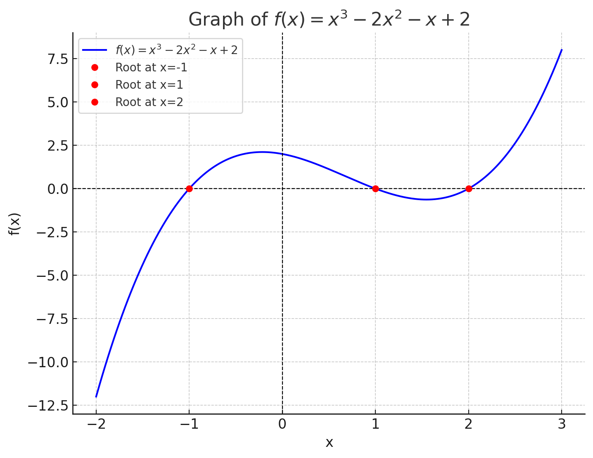

# Aufgabe

Zeichne die Function \(f(x) = x^3 - 2x^2 - x + 2\) mittels ChatGPT, python und matplotlib und diskutiere die Funktion.

# Lösung

## Direkte Frage

- **Prompt**: \blue{Zeichne die Function \(f(x) = x^3 - 2x^2 - x + 2\) mittels python und matplotlib und diskutiere die Funktion.}

Fragt man ChatGPT direkt, bekommt man eine erste Antwort, die ein Verständnis von Ableitungen und Extremstellen vorraussetzt.

Die Funktion \(f(x) = x^3 - 2x^2 - x + 2\) wurde wie gewünscht dargestellt. Nun diskutieren wir die Eigenschaften der Funktion:

#### 1. **Nullstellen**
Die Nullstellen der Funktion sind die Werte von \(x\), bei denen \(f(x) = 0\). Diese wurden in der Grafik hervorgehoben:
- \(x = -1\)
- \(x = 1\)
- \(x = 2\)

#### 2. **Verhalten im Unendlichen**
Da \(f(x)\) eine kubische Funktion ist, dominiert für große Werte von \(x\) der \(x^3\)-Term:
- Für \(x \to \infty\): \(f(x) \to \infty\)
- Für \(x \to -\infty\): \(f(x) \to -\infty\)

#### 3. **Ableitungen und Extrempunkte**
Die Ableitungen sind wie folgt:
- Erste Ableitung: \(f'(x) = 3x^2 - 4x - 1\) (gibt Hinweise auf Extrempunkte)
- Zweite Ableitung: \(f''(x) = 6x - 4\) (gibt Hinweise auf Krümmungsverhalten)

Lösungen von \(f'(x) = 0\) liefern die Extremstellen. Diese können weiter analysiert werden:
- Extremstellen liegen bei \(x = -\frac{1}{3}\) (Minimum) und \(x = 2\) (Maximum).

#### 4. **Krümmung**
Die Wendestelle liegt bei \(f''(x) = 0 \Rightarrow x = \frac{2}{3}\).

Möchten Sie weitere Details oder eine tiefergehende Analyse (z. B. mit Berechnungen der Ableitungen)?

## Folgefragen

### Extremstellen

- **Prompt**: \blue{Ich in der 9ten. In einfachen Worten: Was meinst du mit "Extremstellen"?}

Kein Problem, ich erkläre es dir einfach!

**Extremstellen** sind Punkte auf dem Graphen einer Funktion, wo die Kurve entweder einen **Hochpunkt** (Berg) oder einen **Tiefpunkt** (Tal) erreicht. 

#### Wie erkennst du Extremstellen?
1. **Hochpunkt**: Die Kurve steigt an, erreicht ihren höchsten Punkt und fällt dann wieder ab.
2. **Tiefpunkt**: Die Kurve fällt ab, erreicht ihren tiefsten Punkt und steigt dann wieder an.

Bei der Funktion \(f(x) = x^3 - 2x^2 - x + 2\) passiert Folgendes:

- Der Graph hat einen **Tiefpunkt** (Tal) bei \(x \approx -\frac{1}{3}\) (etwa -0,33). [\red{flasch}]
- Einen **Hochpunkt** (Berg) gibt es bei \(x = 2\). [\red{flasch}]

#### Warum sind diese Punkte wichtig?

Extremstellen helfen dir zu verstehen, wo eine Funktion am höchsten oder am tiefsten ist, was oft nützlich ist, z. B. wenn du wissen willst, wann etwas am meisten oder am wenigsten ist (z. B. Geschwindigkeit, Kosten, Höhe).

Hoffe, das macht es klarer! Frag gerne weiter, wenn du etwas vertiefen möchtest.

\newpage

### Extremstellen im Graphen

- **Prompt**: \blue{BItte zeichne diese Extremstellen im Graphen ein.}

Im aktualisierten Graphen habe ich die Extremstellen der Funktion \(f(x) = x^3 - 2x^2 - x + 2\) eingezeichnet:

- **Tiefpunkt** (grüner Punkt): Dieser liegt bei etwa \(x = -0.33\). [\red{flasch}]
- **Hochpunkt** (magenta Punkt): Dieser liegt bei \(x = 2\). [\red{flasch}]

Die Punkte zeigen dir, wo die Funktion ein Tal (Tiefpunkt) oder einen Berg (Hochpunkt) erreicht. Wenn du weitere Fragen dazu hast, lass es mich wissen!

- **Prompt**: \blue{Komisch im graph steht 1.55 und Du sagst 2.0 was ist jetzt richtig}

Gute Frage! Lass uns das Missverständnis klären.

Es scheint, dass ich bei der schnellen Erklärung versehentlich „2.0“ gesagt habe, anstatt den genauen Wert aus der Berechnung zu nennen. Im Graphen steht der korrekte Wert für den Hochpunkt bei \(x \approx 1.55\).

#### Warum ist es \(x \approx 1.55\) und nicht 2?
Der Hochpunkt wird bestimmt, indem wir die Ableitung \(f'(x) = 3x^2 - 4x - 1\) lösen (\(f'(x) = 0\)). Dadurch finden wir exakt, wo die Steigung der Funktion Null ist (also der Hochpunkt oder Tiefpunkt).

Die numerische Lösung zeigt:
- Tiefpunkt: \(x \approx -0.33\)
- Hochpunkt: \(x \approx 1.55\)

Ich hoffe, das klärt die Verwirrung! Danke, dass du darauf hingewiesen hast.

### Ableitung

- **Prompt**: \blue{Was ist denn die Ableitung in einfachen Worten?}

Die **Ableitung** ist ein Werkzeug in der Mathematik, das dir sagt, **wie schnell sich eine Funktion verändert**.

#### Stell dir das so vor:
Wenn du eine Kurve wie den Graphen von \(f(x)\) anschaust, gibt es Stellen, wo sie:
- Steigt (geht nach oben),
- Fällt (geht nach unten),
- Oder an einem Extrempunkt flach ist (weder steigt noch fällt).

Die Ableitung sagt dir an jedem Punkt der Kurve:
1. **Wie stark** die Kurve steigt oder fällt.
2. **Ob** die Kurve überhaupt steigt oder fällt.

#### Beispiele im Alltag:
- **Geschwindigkeit**: Wenn du mit dem Fahrrad fährst, zeigt dir die Ableitung deiner Strecke, wie schnell du gerade bist.
- **Kosten**: Bei Kostenfunktionen zeigt die Ableitung, wie stark die Kosten steigen, wenn du etwas mehr produzieren willst.

#### Und warum brauchen wir das hier?
Die **Extremstellen** (Hoch- und Tiefpunkte) sind genau da, wo die Steigung \(= 0\) ist. Das heißt, die Ableitung \(f'(x)\) hilft uns, solche Punkte zu finden, weil sie uns zeigt, wo der Graph "flach" wird.

War das verständlich? Frag gerne weiter!

### Ableitungsberechnung

- **Prompt**: \blue{Was machst wenn Du f'() berechnest?}

Wenn ich \(f'(x)\) berechne, mache ich Folgendes:

Die Ableitung \(f'(x)\) ist die Funktion, die uns zeigt, **wie sich \(f(x)\) an jedem Punkt ändert**. Um \(f'(x)\) zu berechnen, nehme ich die ursprüngliche Funktion \(f(x)\) und wende bestimmte Regeln an, die wir **Ableitungsregeln** nennen.

Hier ist die Funktion \(f(x) = x^3 - 2x^2 - x + 2\).

#### Schritt-für-Schritt-Berechnung der Ableitung \(f'(x)\):
1. **Regel: Potenzregel**  
   Bei \(x^n\) wird \(n\) vorgezogen und die Potenz um 1 verringert.  
   - Beispiel: \(\frac{d}{dx}(x^3) = 3x^2\)

2. Wende die Potenzregel auf jeden Teil von \(f(x)\) an:
   - Für \(x^3\): Die Ableitung ist \(3x^2\).
   - Für \(-2x^2\): Die Ableitung ist \(-4x\) (weil \(2 \cdot 2 = 4\)).
   - Für \(-x\): Die Ableitung ist \(-1\).
   - Für \(+2\): Die Ableitung ist \(0\) (weil konstante Zahlen keine Änderung haben).

3. Setze alles zusammen:
   \[
   f'(x) = 3x^2 - 4x - 1
   \]

#### Was habe ich gemacht?
Ich habe jeden Teil der Funktion \(f(x)\) getrennt abgeleitet und die Ergebnisse addiert.

#### Warum machen wir das?
Die Ableitung \(f'(x)\) gibt uns:
- Die **Steigung** des Graphen von \(f(x)\) an jedem Punkt \(x\),
- Informationen, wo der Graph steigt, fällt oder flach ist (z. B. bei Hoch- und Tiefpunkten).

Wenn du möchtest, können wir zusammen weitere Ableitungen üben!

### Zusammenfassung

- **Prompt**: \blue{Bitte zeichne jetzt den Graph mit der Funktion, die Nullstellen, die Ableitung die Extremas, als Zusammenfassung}

Hier ist der zusammenfassende Graph:

1. **Die Funktion \(f(x)\):** Der blaue Graph zeigt die Kurve der Funktion \(f(x) = x^3 - 2x^2 - x + 2\).
2. **Die Ableitung \(f'(x)\):** Der grüne gestrichelte Graph zeigt die Steigung der Funktion an jedem Punkt.
3. **Nullstellen:** Die roten Punkte markieren die Stellen, an denen \(f(x) = 0\):
   - \(x = -1\), \(x = 1\), \(x = 2\).
4. **Extremstellen:** 
   - Der **Tiefpunkt** (grüner Punkt) liegt bei \(x \approx -0.33\).
   - Der **Hochpunkt** (magenta Punkt) liegt bei \(x \approx 1.55\).

Dieser Graph fasst die wichtigsten Eigenschaften der Funktion und ihrer Ableitung zusammen. Lass mich wissen, falls du weitere Fragen hast oder etwas genauer erklärt haben möchtest!

