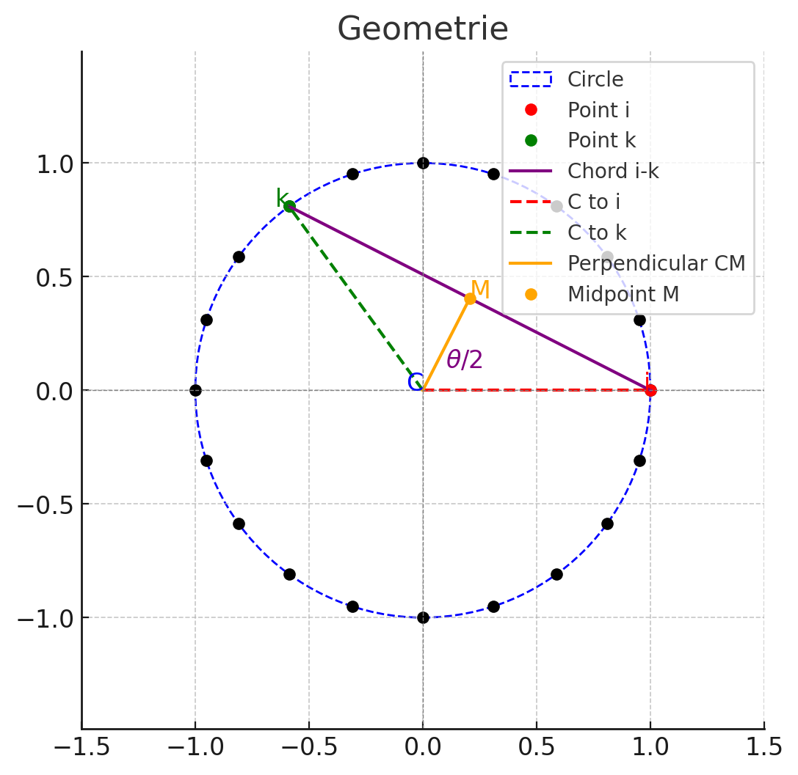

# Aufgabe

Nina hat einen Kreis mit 20 Punkten in 20 gleich lange Kreisbögen geteilt.
Sie zeichnet alle Sehnen ein, die zwei dieser Punkte verbinden. Wie viele dieser
Sehnen sind länger als der Radius, aber kürzer als der Durchmesser des Kreises?

(A) 90 (B) 100 (C) 120 (D) 140 (E ) 160

# Lösung

Fragt man ChatGPT direkt nach einer Lösung, bekommt man eine falsche Antwort. Man muss Schrittweise vorgehen um die richtige Antwort zu bekommen.

Ein Vorgehen kann sein:

- Erfasse die geometrische Struktur des Problems.
- Das Problem in mathematischer Sprache:
    - Welche Variablen sind relevant?
    - Welche Indizes?
    - Wo befineden wir uns: Trigonometrie, Geometrie, Kombninatorik, ....?
- Welche notwendigen Zwischenschritte braucht es?


## 1. Die Geometrie des Problems

- **Prompt**: \blue{Mittels python matplotlib zeichne einen Kreis mit 20 Punkten in 20 gleich lange Kreisbögen geteilt. Zeichne eine Sehne ein, und verbinde deren Endpunkte mit dem Mittelpunkt des Kreises. Bezeichne einen Endpunkt der Sehne als i und den anderen als k. k und i sollten nicht gegenüberliegen. }
- **Prompt**: \blue{Zeichne zudem das Lot vom Zentrum C auf die Sehne bei M.}
- **Prompt**: \blue{Benenne den Winkel zwischen \(\overline{CM}\) und \(\overline{Mi}\) \(\theta/2\) in der Ecke MCi. Verwende "Geometrie" als Titel}



\newpage

### 2. Mathematische Formulierung

- **Prompt**: \blue{Bitte beschreibe das obige Diagram}

Das obige Diagramm stellt eine geometrische Konstruktion dar, die folgende Elemente enthält:

#### 3.1. **Kreis**:
   - Der Kreis hat das Zentrum \(C\) (blau markiert) und einen Radius von \(1\).
   - Der Kreis ist in 20 gleiche Kreisbögen unterteilt, wobei 20 Punkte entlang des Kreises dargestellt sind.

#### 3.2. **Punkte \(i\) und \(k\)**:
   - Zwei Punkte auf dem Kreis, \(i\) (rot markiert) und \(k\) (grün markiert), sind ausgewählt und durch eine **Sehne** verbunden (lila Linie).

#### 3.3. **Mittelpunkt der Sehne**:
   - Der Punkt \(M\) (orange markiert) ist der Mittelpunkt der Sehne \(i-k\). 
   - Eine senkrechte Linie (orange Linie) verbindet das Zentrum \(C\) mit \(M\), also das **Lot von \(C\) auf die Sehne**.

#### 3.4. **Winkel \(\theta/2\)**:
   - Der Winkel \(\theta/2\) (in der Ecke \(MCi\)) ist zwischen der Verbindungslinie \(C\) zu \(M\) und \(C\) zu \(i\) eingezeichnet.

#### 3.5. **Zusätzliche Details**:
   - Die Verbindungslinien \(C \to i\) (rot gestrichelt) und \(C \to k\) (grün gestrichelt) verdeutlichen die Positionen der Punkte \(i\) und \(k\) relativ zum Kreismittelpunkt.
   - Der Ursprung der Koordinatenebene ist als graue gestrichelte Achsen gekennzeichnet.
   - Der Titel „Geometrie“ beschreibt die allgemeine mathematische Konstruktion des Diagramms.


### 3. Berechnung der Sehnenlänge

- **Prompt**: \blue{Wie kann ich die Länge der Sehne \(\overline{ki}\) in Abhängigkeit von k berechnen?}

Um die Länge der Sehne \(\overline{ki}\) in Abhängigkeit von \(k\) zu berechnen, können wir die Geometrie des Kreises und die trigonometrischen Beziehungen im rechtwinkligen Dreieck \(C M i\) nutzen. Die Schritte sind wie folgt:


#### 3.1. **Kreis-Geometrie und Winkeldefinition**
- Der Punkt \(i\) liegt auf dem Kreis bei \(\theta_i = 0\) (Startpunkt).
- Der Punkt \(k\) liegt auf dem Kreis bei \(\theta_k = \frac{2\pi k}{n}\), wobei \(n\) die Anzahl der Punkte auf dem Kreis ist (\(n = 20\)).
- Die Sehne \(\overline{ki}\) ist die direkte Verbindung zwischen \(i\) und \(k\).


#### 3.2. **Länge der Sehne \(\overline{ki}\)**
Die Länge der Sehne \(\overline{ki}\) kann durch die Kreiswinkel und den Kosinussatz berechnet werden. Für zwei Punkte auf einem Kreis gilt:
\[
\text{Länge der Sehne} = 2R \sin\left(\frac{\Delta \theta}{2}\right)
\]
Hier ist:
- \(R = 1\) der Radius des Kreises,
- \(\Delta \theta = \theta_k - \theta_i = \frac{2\pi k}{n}\).

Einsetzen ergibt:
\[
\overline{ki} = 2 \cdot \sin\left(\frac{\pi k}{n}\right)
\]


#### 3.3. **Dreieck \(C M i\)**
Das Dreieck \(C M i\) ist rechtwinklig, wobei:
- \(C\) ist der Mittelpunkt des Kreises,
- \(M\) ist der Lotfußpunkt auf der Sehne,
- \(i\) ist ein Punkt der Sehne.

Die Winkel und Seiten im Dreieck können genutzt werden:
1. \(\angle M C i = \frac{\theta_k}{2} = \frac{\pi k}{n}\).
2. Die Katheten \(C M\) und \(M i\) sind:
   - \(C M = \cos\left(\frac{\pi k}{n}\right)\),
   - \(M i = \sin\left(\frac{\pi k}{n}\right)\).

Da \(\overline{ki}\) doppelt so groß ist wie \(M i\), folgt:
\[
\overline{ki} = 2 \cdot \sin\left(\frac{\pi k}{n}\right)
\]


#### 3.4. **Zusammenfassung**
Die Länge der Sehne \(\overline{ki}\) in Abhängigkeit von \(k\) ist:
\[
\boxed{\overline{ki} = 2 \cdot \sin\left(\frac{\pi k}{n}\right)}
\]
Hierbei:
- \(k\) läuft von \(1\) bis \(n-1\),
- \(n = 20\) ist die Anzahl der Punkte auf dem Kreis.

Dieses Ergebnis basiert auf der Geometrie des Kreises und der trigonometrischen Beziehungen im rechtwinkligen Dreieck \(C M i\).


### 4. Berechnung der Anzahl von Sehnen


ChatGPT hat Schwierigkeiten, die Anzahl der Sehnen zu berechnen, die länger als der Radius, aber kürzer als der Durchmesser des Kreises sind. Wir können dies jedoch durch mathematische Berechnungen und Python-Code herausfinden.

#### 4.1. **Anzahl der Sehnen mit Bedingung mittels python**

- **Prompt**: \blue{Für welches k ist die Sehne länger  als r, aber auch *kürzer* als 2*r, mittels python?}

```python
import numpy as np

# Parameters
n = 20  # Number of points
r = 1  # Radius of the circle

# Calculate the chord length for each k
k_values = np.arange(1, n)  # k from 1 to n-1
chord_lengths = 2 * np.sin(np.pi * k_values / n)

# Find k values where the chord length is longer than r but shorter than 2*r
valid_k = k_values[(chord_lengths > r) & (chord_lengths < 2 * r)]

# Show results
valid_k, chord_lengths[(chord_lengths > r) & (chord_lengths < 2 * r)]
```
Die Werte von \(k\), für die die Sehne länger als \(r\) (Radius) und kürzer als \(2r\) ist, sind:

\[
k = \{4, 5, 6, 7, 8, 9, 11, 12, 13, 14, 15, 16\}
\]

Die entsprechenden Sehnenlängen sind:
\[
\{1.18, 1.41, 1.62, 1.78, 1.90, 1.98, 1.98, 1.90, 1.78, 1.62, 1.41, 1.18\}
\]

Alle Werte sind auf zwei Dezimalstellen gerundet.

#### 4.2. **Anzahl der Sehnen ohne python**

Wenn wir den Weg ohne Python gehen, müssen wir in Schritten vorgehen:


- **Prompt**: \blue{Für welches k ist die Sehne länger  als r?}

Um herauszufinden, für welche Werte von \(k\) die Sehne \(\overline{ki}\) länger als \(r\) ist, verwenden wir die zuvor hergeleitete Formel für die Sehnenlänge:

\[
\overline{ki} = 2 \cdot \sin\left(\frac{\pi k}{n}\right)
\]

Dabei ist der Radius \(r = 1\).

- **Bedingung**:
Die Sehne ist länger als der Radius (\(r = 1\)), wenn:
\[
2 \cdot \sin\left(\frac{\pi k}{n}\right) > 1
\]

Teilen durch 2 ergibt:
\[
\sin\left(\frac{\pi k}{n}\right) > \frac{1}{2}
\]


- **Lösung der Ungleichung**:
1. \(\sin(x) > \frac{1}{2}\) ist erfüllt für:
   \[
   x \in \left(\frac{\pi}{6}, \frac{5\pi}{6}\right) \quad \text{(im Intervall von \(0\) bis \(\pi\))}.
   \]

2. Ersetzen von \(x = \frac{\pi k}{n}\):
   \[
   \frac{\pi k}{n} \in \left(\frac{\pi}{6}, \frac{5\pi}{6}\right)
   \]

3. Vereinfachen:
   \[
   \frac{k}{n} \in \left(\frac{1}{6}, \frac{5}{6}\right)
   \]

4. Multiplizieren mit \(n\):
   \[
   k \in \left(\frac{n}{6}, \frac{5n}{6}\right)
   \]

- **Für** \(n = 20\):

Einsetzen von \(n = 20\):
\[
k \in \left(\frac{20}{6}, \frac{100}{6}\right) \approx \left(3.33, 16.67\right)
\]

Da \(k\) ganzzahlig ist, gilt:
\[
k \in \{4, 5, 6, \dots, 16\}
\]

- **Antwort:**

Für \(n = 20\) ist die Sehne \(\overline{ki}\) länger als \(r = 1\), wenn:
\[
k \in \{4, 5, 6, \dots, 16\}
\]


### 5. Berechnung der Gesamtzahl der Sehnen aller Punkte ohne Einschränkungen

Wir fragen erst nach dem einfachen Fall, bevor wir die Einschränkungen berücksichtigen.

- **prompt**: \blue{Wieviele Sehnen haben wir wenn wir jeden mit jeden punkt verbinden.}

Um die Anzahl der möglichen Sehnen zu berechnen, wenn jeder Punkt mit jedem anderen Punkt verbunden wird, können wir die Kombinationen berechnen, da die Reihenfolge der Punkte keine Rolle spielt.


#### 5.1 Gegeben:
- Es gibt \(n\) Punkte auf dem Kreis.
- Eine Sehne wird durch 2 Punkte definiert.

Die Anzahl der möglichen Sehnen ist:
\[
\text{Anzahl der Sehnen} = \binom{n}{2}
\]


#### 5.2. Berechnung:
Die Formel für die Binomialkoeffizienten lautet:
\[
\binom{n}{2} = \frac{n(n-1)}{2}
\]


#### 5.3. Für \(n = 20\):
Einsetzen von \(n = 20\):
\[
\binom{20}{2} = \frac{20 \cdot 19}{2} = 190
\]


#### 5.4. Antwort:
Für \(n = 20\) Punkte gibt es insgesamt **190 Sehnen**, wenn jeder Punkt mit jedem anderen Punkt verbunden wird.


### 6. Berechnung der Gesamtzahl der Sehnen mit Einschränkungen

Jetzt berücksichtigen wir die Einschränkungen, dass die Sehnen länger als der Radius, aber kürzer als der Durchmesser des Kreises sein müssen. Das machen wir sehr expilzit, damit ChatGPT uns nicht in die Irre führt.

- **Prompt**: \blue{Wieviele \(ks\) bleiben übrig wenn wir gemäss unserer obigen REchung nur Sehnen der Länge \(>r\) und \(<2r\) berücksichtigen. Ersetze das \((n-1)\) im Binomialkoeffizienten durch 12}

Wenn wir nur Sehnen berücksichtigen, deren Länge \(> r\) und \(< 2r\) ist, und zusätzlich das \((n-1)\) im Binomialkoeffizienten durch 12 ersetzen, müssen wir die Sehnen mit diesen Bedingungen zählen.


#### 6.1. Vorgehen:
1. **Gesamtzahl der Sehnen:**
   Die ursprüngliche Anzahl der Sehnen für \(n = 20\) Punkte ist:
   \[
   \binom{20}{2} = \frac{20 \cdot 19}{2} = 190
   \]

2. **Sehnen mit Länge \(> r\) und \(< 2r\):**
   Aus der obigen Berechnung wissen wir, dass diese Sehnen nur für:
   \[
   k \in \{4, 5, 6, 7, 8, 9, 11, 12, 13, 14, 15, 16\}
   \]
   gültig sind. Das ergibt **12 gültige Werte für \(k\)**.

3. **Ersetzen von \((n-1)\) durch 12:**
   Statt \((n-1)\) verwenden wir nun 12 für die Anzahl der Verbindungen pro Punkt. Damit ergibt sich die angepasste Anzahl der Sehnen als:
   \[
   \binom{n}{2} \quad \text{mit } (n-1) = 12
   \]

   Das bedeutet:
   \[
   \text{Neue Anzahl} = \frac{n \cdot 12}{2}
   \]

4. **Für \(n = 20\):**
   Einsetzen von \(n = 20\) ergibt:
   \[
   \text{Neue Anzahl} = \frac{20 \cdot 12}{2} = 120
   \]


#### 6.1. Antwort:
Wenn wir nur Sehnen der Länge \(> r\) und \(< 2r\) berücksichtigen und \((n-1)\) durch 12 ersetzen, bleiben **120 Sehnen** übrig.
