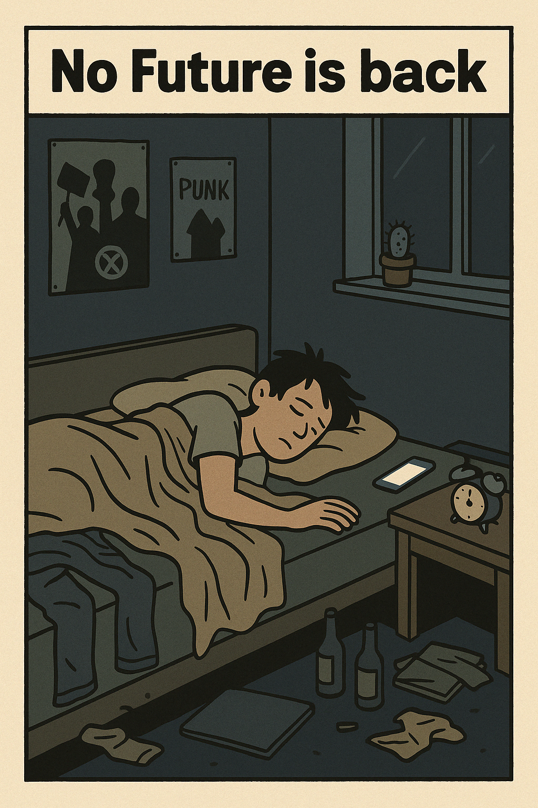

# Vorbereitung

- **Prompt**: 

  - Ich möchte für meinen Comic "No Future is back" die erste Seite erstellen. 

  - **Storyline**: Tom führt ein chaotisches Leben. Offiziell studiert er, um sich die Unterstützung seiner Eltern zu sichern. Er sieht die Krisen in der Welt, sieht aber keinen Weg für sich, an einer Verbesserung mitzuarbeiten. Sich anzupassen, die Augen zu verschließen und an seiner Karriere zu arbeiten, gelingt ihm auch nicht. So lässt er sich treiben.

  - Das Comic soll in einem reduzierten Comic-Stil gezeichnet werden.

  - Auf den ersten Seiten geht es darum, dass Tom schläft, den Alarm (visuell und akustisch) seines Handys ignoriert und schließlich durch einen alten analogen Wecker geweckt wird.

  - Bitte schreibe ein kurzes Storyboard:

    - Die Beschreibung von Seite 1
    - Detaillierte Beschreibung der Bilder (Panels) von Seite 1: Titel und detaillierte Beschreibung.

- **KI-Antwort**:

Klar, das klingt nach einem starken, introspektiven Einstieg! Ich schreib dir ein Storyboard für **Seite 1** von *No Future is back* – im reduzierten Stil und passend zur Stimmung von Orientierungslosigkeit, Müdigkeit und Alltagstrott.

---

## **Seite 1 – Storyboard**

**Seite-Titel (optional im Panel 1 eingeblendet oder darüber):**  
**"Kapitel 1: Wake-up Call"**

### **Panel 1: Totale – Tom im Bett, Nacht**
**Titel (im Bild):** *No Future is back*  
**Beschreibung:**  
Ein chaotisches Zimmer im Halbdunkel. Tom liegt im Bett, halb unter einer zerknüllten Decke. Kleidung, leere Bierflaschen, Bücher und ein Laptop liegen verstreut. Nur das Display eines Handys leuchtet.  
*Stimmung:* Stillstand, Orientierungslosigkeit.  
*Details:* Poster an der Wand (z. B. Klimaproteste, Punkband), aber vergilbt. Ein kleiner Kaktus auf der Fensterbank, vertrocknet.  
*Sound/Visual:* Kein Ton – nur visuelles Setup.

---

### **Panel 2: Close-up – Handy zeigt Wecker-Alarm**
**Titel:** *"07:00 – WAKE UP!"*  
**Beschreibung:**  
Das Handy-Display zeigt eine Alarm-Nachricht mit schrillem Design (große Schrift, aggressive Farben). Vibrationslinien deuten die Bewegung an.  
*Sound (Comic-Schriftzug):* **BZZZ! BZZZ! BZZZ!**  
*Details:* Risse im Display, ein Fleck auf dem Bildschirm.

---

### **Panel 3: Halbnah – Tom dreht sich weg**
**Titel:** *Keine Lust aufzustehen*  
**Beschreibung:**  
Tom blinzelt mit einem Auge, verzieht das Gesicht und dreht sich genervt zur Seite.  
*Sound:* **MMPF...**  
*Details:* Er zieht sich das Kissen übers Gesicht. Ein Lichtstrahl fällt durchs Fenster, zeigt Staub in der Luft.

---

### **Panel 4: Close-up – Handy fällt vom Nachttisch**
**Titel:** *Abgelehnt.*  
**Beschreibung:**  
Tom greift halbherzig nach dem Handy, verfehlt es. Es fällt klirrend vom Nachttisch.  
*Sound:* **KLACK!**  
*Details:* Display zeigt immer noch "WAKE UP", jetzt liegt es kopfüber auf dem Boden.

---

### **Panel 5: Halbnah – Stillstand**
**Titel:** *Stille nach dem Alarm.*  
**Beschreibung:**  
Der Raum ist wieder ruhig. Tom liegt regungslos da. Alles wirkt eingefroren.  
*Sound:* –  
*Details:* Licht wird etwas heller. Man sieht den alten Wecker im Hintergrund (klassischer analoger Wecker mit Glocken).

---

### **Panel 6: Nahaufnahme – Alter Wecker klingelt**
**Titel:** *"Die alte Schule."*  
**Beschreibung:**  
Der analoge Wecker zeigt 07:15 und klingelt laut. Bewegungslinien zeigen, wie er vibriert.  
*Sound:* **RRRIIIINNNGG!!!**  
*Details:* Er steht auf einem wackeligen Bücherstapel. Die Szene wirkt aus der Zeit gefallen.

---

### **Panel 7: Close-up – Tom reißt ein Auge auf**
**Titel:** *"Widerwilliges Erwachen."*  
**Beschreibung:**  
Ein einzelnes, müdes Auge öffnet sich. Blick leer, aber genervt.  
*Sound:* **...fuck.**  
*Details:* Man sieht einen Abdruck vom Kissen im Gesicht, leichte Augenringe.

---

Wenn du magst, kann ich dir daraus auch direkt ein Seitenlayout skizzieren oder dir helfen, den Stil visuell zu entwickeln. Möchtest du eine Visualisierung davon im nächsten Schritt?

\newpage

# Seite 1

- **Prompt**: 

 - Bitte zeichne die erste Seite des Comics.

- **KI-Antwort**:

{width=60%}

Das KI-Antwort ist nicht überzeugend. Wir haben die KI überfordert. Wir müssen Panel für Panel vorgehen.

\newpage

# Prompt: Panel 1

### Prompt: Panel 1 - Titel: "Der Wecker klingelt"

Lass uns Schrittweise vorgehen. Zeichne nur mal das 1 Panel in Farbe

{width=60%}

### Prompt: Panel 1 - Beschreibung
Du bist ein Comiczeichner und weist worauf es ankommt dass ein Comic funktioniert. Dieses Bild ist das erste Panel auf Seite 1 meines Comics. Bitte beschreibe die Details so dass ich ein nächstes passendes Bild erzeugen kann.

- Stil, Farben
- Raum, Perspektive, Szenerie
- Möbel, Boden
- Gegenstände und ihre Positionen im Raum
- Person, Körperhaltung, Kleidung, Textilien
- Gesicht, Alter, Geschlecht
- Alles was sonst noch wichtig ist das Bild zu reproduzieren

#### Antwort:

Perfekt, wir gehen analytisch vor. Hier ist eine detaillierte Beschreibung des ersten Panels aus deinem Comic „**No Future is back**“, damit du die Szene exakt reproduzieren oder als Grundlage für das nächste Panel weiterentwickeln kannst:

---

## **Stil und Farben**

- **Stil:** Reduzierter, klarer Comicstil (flächige Farben, wenig Schraffuren, keine Texturen).
- **Farbschema:** Gedämpfte Farben mit leichtem Gelbstich – wirkt wie ein Druck auf getöntem Papier (leicht beige).
  - Dominante Töne: Mattes Dunkelblau, Beige, Grau, Braun
  - Lichtquelle: Indirektes, kaltes Mondlicht von rechts (Fenster), keine harten Schatten

---

## **Raum & Perspektive**

- **Kameraposition:** Totale / leicht von oben rechts (etwas Vogelperspektive)
- **Raumaufteilung:** Rechte Raumhälfte zeigt Fenster, linke Seite Wand mit Postern
- **Größe:** Kleines Schlafzimmer, vermutlich WG oder Studentenbude
- **Tiefenwirkung:** Flach, aber klare Staffelung von Vordergrund (Boden) über Bett bis zur Wand

---

## **Möbel & Boden**

- **Bett:**
  - Einfaches, niedriges Einzelbett ohne Kopfteil
  - Grauer Rahmen, ungemachtes Laken in Beige
- **Nachttisch:**
  - Rechts neben dem Bett
  - Dunkelbraunes Holz
  - Darauf:
    - Ein analoger Wecker (Glockenstil, grau)
    - Ein Smartphone mit aktivem Display
- **Fensterbank:**
  - Rechts oben, einfach, mit Blumentopf (Kaktus)
- **Boden:**
  - Dunkelgrau, wirkt wie Teppich oder alter Laminat
  - Unordentlich: 
    - Zwei Bierflaschen
    - Alte Zeitungen oder Papierstapel
    - Ein offenes Notizbuch oder Ordner
    - Ein zerknülltes Shirt oder Unterhose

---

## **Person – Tom**

- **Position:** Liegt quer im Bett, leicht zusammengerollt, rechte Hand ausgestreckt
- **Kleidung:** 
  - Grau-beiges T-Shirt
  - Blaue Jeans, halb ausgezogen, hängen am Fußende
- **Textilien:**
  - Beiges Laken / Decke, über Körper geworfen, chaotisch
  - Einfaches, passendes Kissen
- **Körperhaltung:** Schläft auf der Seite, Gesicht leicht zur Matratze geneigt, wirkt müde und resigniert

---

## **Gesicht & Demografie**

- **Gesicht:** Jung, vermutlich Anfang 20
- **Geschlecht:** Männlich
- **Haar:** Kurz, dunkel, zerzaust
- **Gesichtsausdruck:** Entspannt, leicht erschöpft, geschlossene Augen

---

## **Dekoration & Symbolik**

- **Poster an der Wand (linke Seite):**
  - Linkes Poster: Protestszene / Aktivismus (hochgehaltene Schilder, Symbolik wie Extinction Rebellion)
  - Rechtes Poster: Schriftzug „PUNK“ mit Pfeil
  - Wirkung: Politische Vergangenheit / Haltung, die verblasst ist
- **Pflanze:** Kaktus – Symbol für Vernachlässigung, Trostlosigkeit

---

## **Szenerie & Stimmung**

- **Tageszeit:** Früher Morgen (07:00 Uhr – erkennbar durch Uhr & Display später)
- **Stimmung:**  
  - Müdigkeit, Orientierungslosigkeit, Lethargie
  - Die Szene strahlt Resignation und Alltagstristesse aus  
- **Symbolisch:**  
  - Der analoge Wecker und das moderne Handy nebeneinander symbolisieren Zeitkonflikt oder Vergangenheit vs. Gegenwart
  - Die Unordnung: mentaler Zustand, Chaos

---

Wenn du magst, kann ich daraus direkt das nächste Panel beschreiben – etwa das vibrierende Handy (Panel 2) – und dafür alle Details ableiten, um die Szene glaubwürdig fortzusetzen.  
Willst du damit weitermachen?

### Prompt: Panel 1 - Check

Wiederhole erstmals das Panel1 mit obiger Beschreibung

{width=60%}

\newpage

### Prompt: Panel 2

ok, auf Basis dieser Beschreibung generiere Panel 2
Achte dass Du alles was sich nicht ändert so zeichnest wie Panel 1 (siehe Beschreibung)

{width=90%}

\newpage

### Prompt: Panel 3

Jetzt Panel 3, achte auf das Storyboard, gleicher Stil wie 1

{width=90%}

\newpage

### Prompt: Panel 4,5,6

Jetzt in einem Frame 4,5,6: unterschiedliche Grössen. Achte auf das Handy. Folge dem Storyboard und der obigen Kontext Beschreibung

{width=90%}

\newpage

### Prompt: Panel 7

Und nun Panel 7, achte auf das Storyboard, gleicher Stil wie 1

{width=90%}

\newpage

### Prompt: Panel 2/3

Bringe die Panel 2 and 3 in ein quadratisches Panel

{width=90%}

\newpage

# Finale Seite 1

Mit einem Grafikprogramm erstellen wir die Seite 1.
Wir bringen die Panels in die richtige Reihenfolge und fügen den Titel hinzu.

{width=90%}